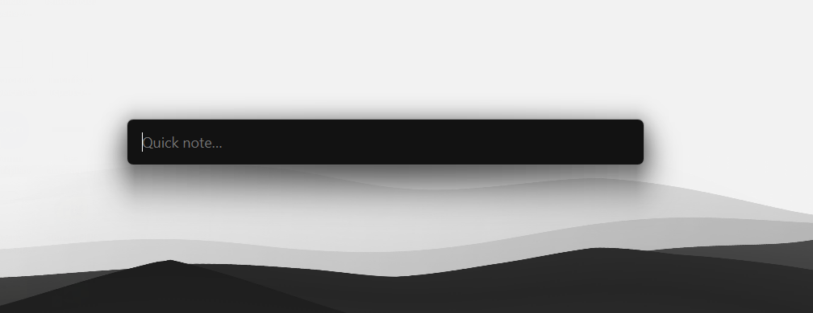

# Quicklly

A hotkey mini-notepad for Windows. Press a global hotkey anywhere, type a thought, hit
<kbd>Enter</kbd> — it is appended with a timestamp to today's markdown file, and you are
back in whatever you were doing.



- **Fast** — the input window pops up instantly on top of everything, already focused.
- **Plain text** — notes are ordinary `.md` files you can open in Obsidian or VS Code and sync
  with OneDrive or Git. No database.
- **Lightweight** — lives in the system tray.

## Installation

Download the installer (`Quicklly_x.y.z_x64-setup.exe`, or the `.msi`) from the
[latest release](https://github.com/ruslan1us/quicklly/releases/latest) and run it.
The installer is not code-signed yet, so Windows SmartScreen may warn you: click
**More info → Run anyway**.

## Usage

| Action                         | How                                         |
| ------------------------------ | ------------------------------------------- |
| Open the input window          | <kbd>Ctrl</kbd>+<kbd>Alt</kbd>+<kbd>N</kbd> (can be changed in the settings), or click the tray icon |
| Save the note                  | <kbd>Enter</kbd>                            |
| New line in the note           | <kbd>Shift</kbd>+<kbd>Enter</kbd>           |
| Previous / next saved note     | <kbd>↑</kbd> / <kbd>↓</kbd> in an empty field |
| Cancel                         | <kbd>Esc</kbd>, or <kbd>Ctrl</kbd>+<kbd>C</kbd> when no text is selected |
| Dismiss, keeping the draft     | Click anywhere outside the window           |
| Open the notes folder          | Tray menu → **Open notes folder**           |
| Settings                       | Type `/config` and press <kbd>Enter</kbd>, or tray menu → **Settings…** |
| Exit                           | Tray menu → **Quit**                        |

## Where notes are stored

Each day gets its own file in `%USERPROFILE%\Documents\Quicklly\`:

```
Quicklly/
  2026-09-26.md
  2026-09-27.md
```

A file looks like this:

```markdown
# 2026-09-26

- 14:32 check why swap keeps growing on prod3
- 15:10 buy a birthday present
- 18:45 coffee tracker in the tray #idea
```

Files are UTF-8; new notes are appended to the end, and the heading is written with the first
note of the day. A multi-line note stays one list item, with the extra lines indented under it:

```markdown
- 19:20 groceries:
  milk
  bread
```

Alternatively, choose **Single inbox** in the settings to keep all notes in one `inbox.md`,
grouped by day:

```markdown
# Inbox

## 2026-09-26

- 14:32 check why swap keeps growing on prod3
- 15:10 buy a birthday present

## 2026-09-27

- 09:05 book a dentist appointment
```

The notes folder can be changed in the settings as well.

## Settings

Open the settings with `/config` in the input window or from the tray menu. They are fully
keyboard-driven:

| Key                                  | Action                                     |
| ------------------------------------ | ------------------------------------------ |
| <kbd>↑</kbd> <kbd>↓</kbd>            | Select a setting                           |
| <kbd>←</kbd> <kbd>→</kbd>            | Switch between values                      |
| <kbd>Enter</kbd>                     | Edit: record a new hotkey, pick a folder   |
| <kbd>Del</kbd>                       | Reset the setting to its default           |
| <kbd>Esc</kbd>, <kbd>Ctrl</kbd>+<kbd>C</kbd> | Close                              |

| Setting            | Default                                     | Options                                      |
| ------------------ | ------------------------------------------- | -------------------------------------------- |
| Hotkey             | <kbd>Ctrl</kbd>+<kbd>Alt</kbd>+<kbd>N</kbd> | Any key or combination except <kbd>Esc</kbd> |
| Notes folder       | `%USERPROFILE%\Documents\Quicklly`          | Any folder                                   |
| Notes file         | One file per day                            | One file per day, or a single `inbox.md`     |
| Theme              | Default                                     | Default (dark), Default+ (dark purple), Light |
| Start with Windows | Off                                         | On, Off                                      |

## Building from source

Prerequisites (on Windows):

- [Node.js](https://nodejs.org/) LTS
- [Rust](https://rustup.rs/) (stable, MSVC toolchain)
- [Microsoft C++ Build Tools](https://visualstudio.microsoft.com/visual-cpp-build-tools/)
  with the Windows SDK
- WebView2 (preinstalled on Windows 10/11)

See the [Tauri prerequisites](https://tauri.app/start/prerequisites/) for details.

```sh
npm install
npm run tauri dev     # run in development mode
npm run tauri build   # build the installer into src-tauri/target/release/bundle/
```

## License

[MIT](LICENSE)
